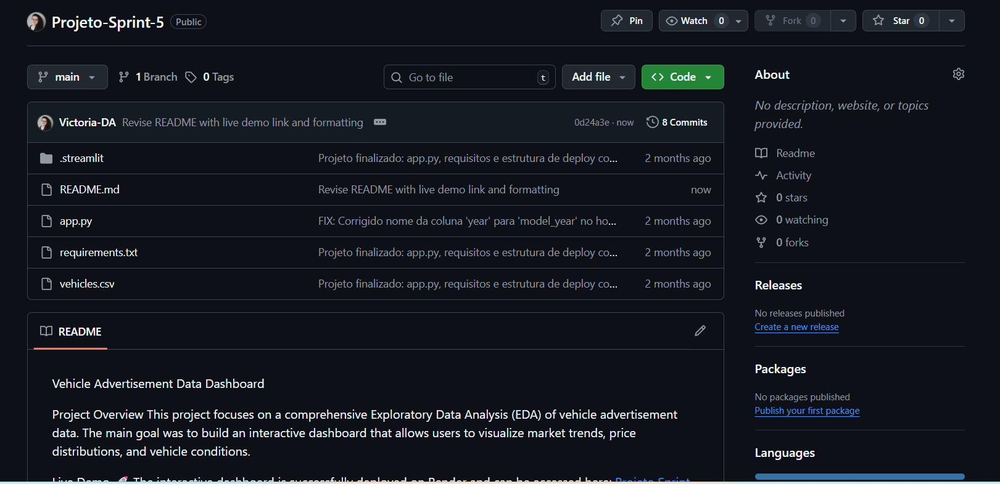

# Vehicle Advertisement Data Dashboard

*Project Highlight: This interactive dashboard provides clear insights into vehicle advertisement data, allowing for dynamic market analysis.*

#Project Overview
This project focuses on a comprehensive Exploratory Data Analysis (EDA) of vehicle advertisement data. The main goal was to build an interactive dashboard that allows users to visualize market trends, price distributions, and vehicle conditions.

Live Demo
🚀 The interactive dashboard is successfully deployed on Render and can be accessed here: [Projeto Sprint 5 - Dashboard de Anúncios de Carros](https://projeto-sprint-5-u70l.onrender.com/)

Technical Stack
Python: Core programming language.

Streamlit: Used for building and deploying the web application.

Pandas: Used for data cleaning and manipulation.

Plotly Express: Used for creating dynamic and interactive visualizations (Histograms and Scatter plots).

Key Features
Data Visualization: Dynamic charts that update based on user interaction (check-boxes and buttons).

Price Analysis: Comparison of vehicle prices across different categories and odometer readings.

Cloud Deployment: Fully functional web app hosted on Render.

